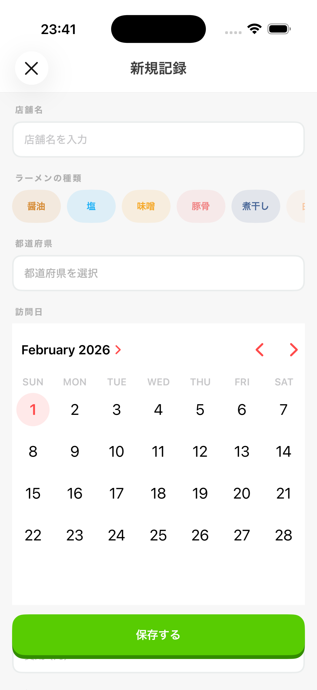
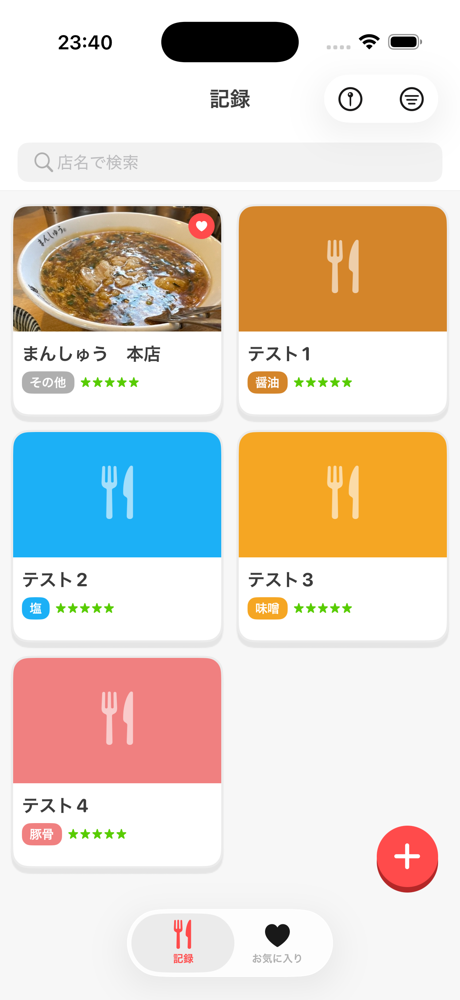
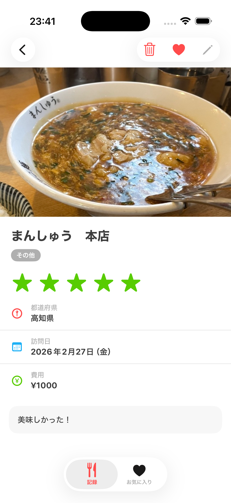
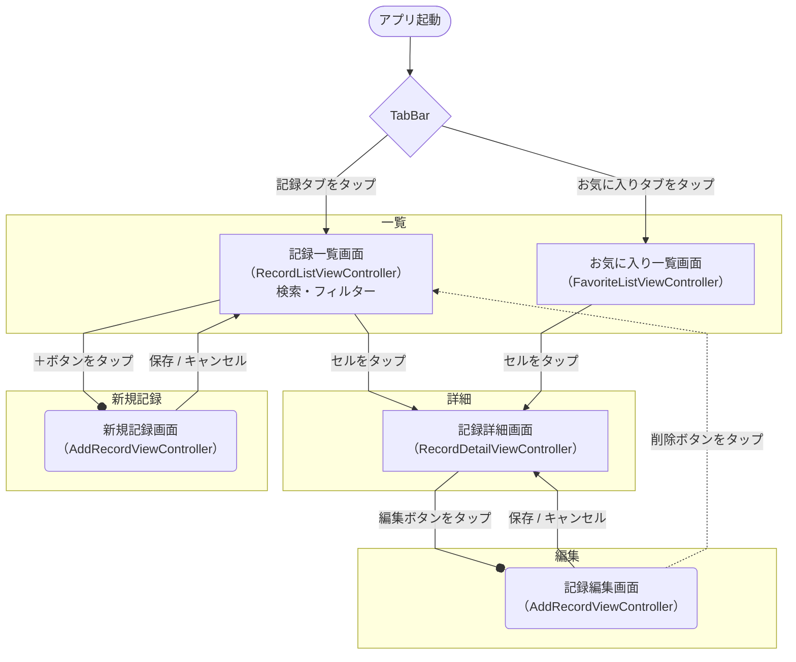

# mennikki

食べたラーメンを記録・管理するiOSアプリです。

---

## どんなアプリ？

ラーメンが好きで、あの店もう一度行きたいけど名前が思い出せない、あの時食べたラーメンどんな味だったっけ……そんな経験はありませんか？

**mennikki** は食べたラーメンをサクッと記録しておける、ラーメン専用の食事日記アプリです。店名・種類・都道府県・日付・費用・星評価・写真・コメントを残せるので、自分だけのラーメンログが作れます。

デザインは明るくカラフルなスタイルを採用。記録することが楽しくなるような、ポップで親しみやすい見た目を目指しています。

---

## できること

### ラーメンを記録する

「+」ボタンをタップして記録を追加できます。登録できる内容は以下の通りです。

- **店名**（必須）
- **ラーメンの種類**（必須）- 醤油 / 塩 / 味噌 / 豚骨 / 煮干し / 白湯 / つけ麺 / 汁なし / 二郎系 / 家系 / その他
- **訪問日**（必須）- カレンダーから選択（未来の日付は不可）
- **都道府県** - 訪問した都道府県をリストから選択
- **費用** - 何円だったかをメモ（最大9,999円）
- **星評価** - 5段階で評価
- **コメント** - 感想や特徴など自由に記述（最大500文字）
- **写真** - フォトライブラリから選択して添付

店名やラーメンの種類はチップ形式で選択でき、訪問日はカレンダーから直感的に選べます。

<p align="center">
  
</p>

### 記録を一覧で見る

ホーム画面では全記録を2列のカードレイアウトで表示します。写真・店名・種類・日付が一目でわかります。訪問日が新しい順に並ぶので、最近食べたラーメンがすぐ確認できます。

カラフルなカードデザインで、ラーメンの種類ごとに色分けされています。右下の「+」ボタンからすぐに新しい記録を追加できます。

<p align="center">
  
</p>

### 記録を探す

食べたことがある店を探したいときに使えます。

- **店名検索** - 店名を入力してリアルタイムに絞り込み
- **種類フィルター** - 「豚骨だけ見たい」など種類で絞り込み（複数選択可）
- **都道府県フィルター** - 「東京の記録だけ見たい」など都道府県で絞り込み

記録をタップすると、写真・星評価・都道府県・訪問日・費用・コメントなど、記録の詳細を確認できます。お気に入り登録や編集・削除もこの画面から行えます。

<p align="center">
  
</p>

### お気に入りに登録する

特に気に入ったラーメンはお気に入りに登録できます。お気に入りタブにまとめて表示されるので、「また行きたい店リスト」として活用できます。

### 記録を編集・削除する

登録後でも内容を修正できます。間違えた情報や、あとから追記したいコメントもいつでも更新可能です。

---

## 画面遷移



---

## 技術情報

- **プラットフォーム**: iOS 17.0+
- **言語**: Swift / UIKit
- **データ保存**: Core Data（ローカルのみ、外部サーバーへの送信なし）
- **外部依存**: なし（Apple 標準フレームワークのみ使用）

---

## 今後の予定

### バグ修正

#### 優先度高
- [ ] 入力項目の必須マーク
- [ ] カレンダーの日本語化
- [ ] 編集画面でも写真の変更と保存ができる導線を作る

#### 優先度低
- [ ] 英語対応
- [ ] ラーメンの種類のフィルターも都道府県のフィルターと同じように、登録されているデータの中のものだけ表示したい
- [ ] フィルター適用中であることを視覚的に示す（バッジやボタン色の変化など）

#### 優先度低
- [ ] 地図上で訪問店を表示（MapKit統合）
- [ ] 訪問日のカレンダー一覧表示
- [ ] iPad対応（UISplitViewController使用）

---

## セットアップ

```
1. リポジトリをクローン
2. mennikki.xcodeproj を Xcode で開く
3. ターゲットデバイスを選択してビルド・実行
```
